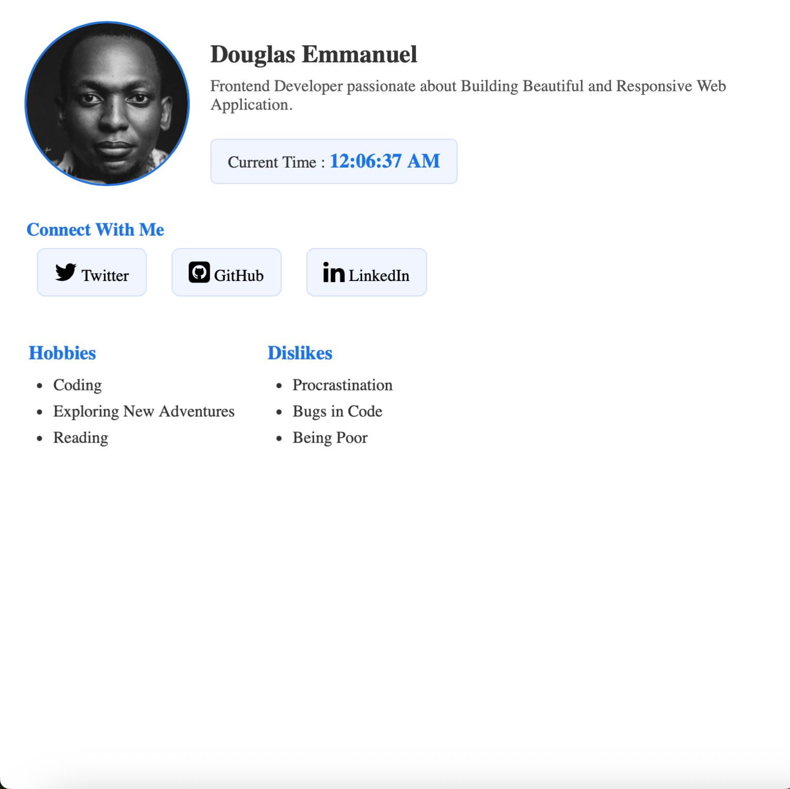

That’s a great little **profile card project**, Douglas 💪 — perfect for a personal web component or portfolio starter.
Here’s a **professional, well-formatted GitHub README.md** you can use directly in your repository.

---

## 🧑‍💻 Personal Profile Card

A **responsive personal profile card** built with **HTML**, **CSS**, and **Vanilla JavaScript** — featuring a live clock, social media links with Font Awesome icons, and neatly organized hobby/dislike sections.

---

### 🚀 Demo

👉 **[Live Preview (optional link)](https://yourusername.github.io/profile-card/)**
*(Replace with your GitHub Pages or deployed URL)*

---

### 🖼️ Preview



---

### 🧩 Features

✅ Clean, minimal, and centered layout
✅ Responsive design for all screen sizes
✅ Dynamic **current time** (updates every second)
✅ Integrated **Font Awesome** social media icons
✅ Organized **Hobbies** and **Dislikes** sections
✅ Accessible and semantic HTML structure with `data-testid` attributes

---

### 🛠️ Technologies Used

* **HTML5** – Structure and semantics
* **CSS3** – Styling and layout
* **JavaScript (Vanilla)** – Dynamic time display
* **Font Awesome** – Social media icons

---

### 📁 Project Structure

```bash
profile-card/
│
├── index.html              # Main profile card HTML file
├── css/
│   └── profile_card.css    # Stylesheet for layout and design
├── js/
│   └── profile_card.js     # Script for live time update
└── images/
    └── Douglas.jpeg        # Profile image (or hosted image)
```

---

### ⚙️ Setup Instructions

1. **Clone the repository**

   ```bash
   git clone https://github.com/Douglasemmanuel/HNG-13-STAGE-0-FRONTEND-DEVELOPMENT-TRACK.git
   ```

2. **Open the project**

   ```bash
   cd profilecard
   ```

3. **Run locally**

   * Simply open `index.html` in your browser
     *(No build tools or dependencies needed)*

---

### 🧠 Code Highlights

#### 🕒 Live Time Function (in `profile_card.js`)

```js
function showCurrentTime() {
  const clock = document.querySelector('[data-testid="test-user-time"]');
  const now = new Date();
  clock.textContent = now.toLocaleTimeString();
}

showCurrentTime();
setInterval(showCurrentTime, 1000);
```

This function automatically updates the displayed time every second.

---

### 💅 Styling Highlights (in `profile_card.css`)

* Centered layout using **Flexbox**
* Soft blue accents for highlights
* Hover effects for links and social icons
* Rounded profile picture and section boxes

---


### 🪪 License

This project is open-source and available under the **MIT License**.

---
